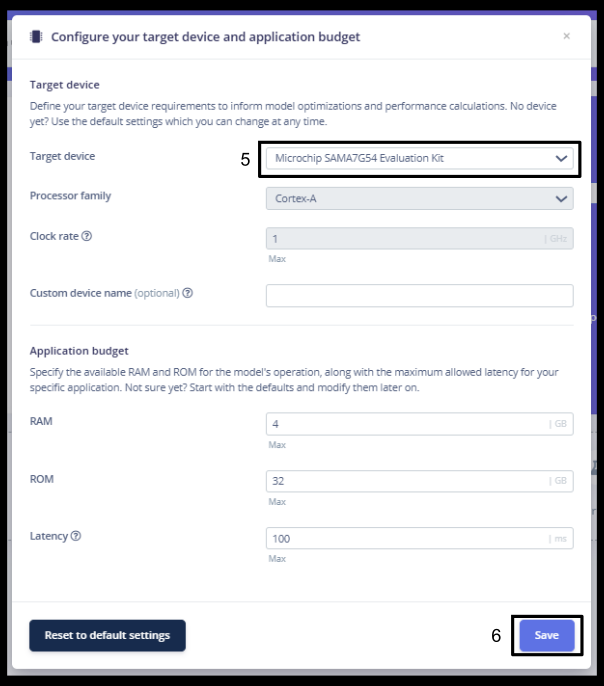
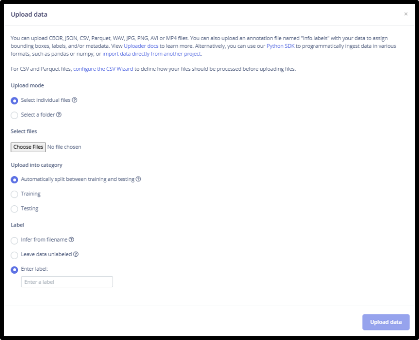

# Getting Started with Edge Impulse

## Introduction

Edge Impulse is a powerful platform for developing machine learning models specifically for embedded and edge devices. It simplifies the process of collecting data, extracting meaningful features, training models, and deploying them directly to devices making it much easier to create real-time, intelligent applications at the edge.

With support for audio, vision, and sensor data, Edge Impulse empowers developers to build solutions that run directly on microcontrollers, embedded Linux devices, and other low-power hardware. The platform’s intuitive interface, robust APIs, and flexible deployment options make it a go-to choice for applications like predictive maintenance, environmental monitoring, industrial IoT, and much more.

## Steps

### 1️⃣ Setting Up Edge Impulse and Configuring the Target Device

1. Sign up for an Edge Impulse account by visiting [Edge Impulse Signup](https://edgeimpulse.com/signup).
2. After successfully logging in, locate the **+ Create new project** button on the home page. Click this button to initiate the project setup process.
3. Enter a project name and select either **Public** or **Private** for the project visibility. Click **Create new project** to complete the setup.
4. In the **Dashboard** menu, click the button in the top-right corner to add a target device.  
5. In the **Target device** drop-down menu, select **Microchip SAMA7G54 Evaluation Kit**.
6. Click the **Save** button to save the configuration. 
   

### 2️⃣ Data Collection and Uploading for Model Training

1. The model requires a dataset for training, which can be sourced through various methods such as recordings, live capture, or online datasets. In this project, the dataset is sourced from the [Kaggle](https://www.kaggle.com/) platform. 
    
   **📌About the Dataset:** The **IDMT-ISA-ELECTRIC-ENGINE** dataset contains audio files from three similar units of an electrical engine (2ACT Motor Brushless DC 42BLF01, 4000 RPM, 24VDC). These recordings simulate different acoustic conditions:  
   **Dataset Specifications:**
   - **Sampling Rate:** 44.1 kHz
   - **Resolution:** 32-bit
   - **Audio Type:** Mono
   - **States:** Good, Heavy Load, Broken  
2. Go to the **Data Acquisition** tab in the Edge Impulse project dashboard. This tab provides multiple options for data collection, including:
   - Capturing data from target hardware
   - Capturing data using a mobile phone
   - Uploading files in various formats
3. For this project, the `.wav` files will be uploaded directly from the PC. Follow these steps:  
   3.1 Click the **Upload** button in the **Data Acquisition** tab.  
   3.2 Select upload mode as individual files.  
   3.3 Select the files from the system.  
   3.4 In the **Upload into Category** field, select whether the data will be used for training or testing. If **Automatic split** is selected, the platform will handle the train/test split automatically.  
   3.5 Label the dataset based on the uploaded data.  
   3.6 Click **Upload** to upload the data.  
   

### 3️⃣ Creating Impulse

1. In the **Experiments** tab, click **Create new impulse**.
2. Click **Add a processing block**. In this project, the **Mel Filterbank Energy (MFE)** processing block is used.
3. Click **Add a learning block**. In this project, the **Classification** learning block (CNN-based model) is used.
   > **📝Note:**  1. The platform automatically configures these blocks based on the uploaded dataset.  2. Users can also add custom processing and learning blocks to the impulse design.  3. Ensure the model is designed according to the specific application needs.  

#### Working

- **Time Series Data**: This step splits the input into specific window sizes, which are fed to the processing block.

- **Processing Block**: This block extracts meaningful features from the data to build a small and reliable machine learning model.

- **Learning Block**: After feature extraction using the processing block, the model is trained using the learning block.
